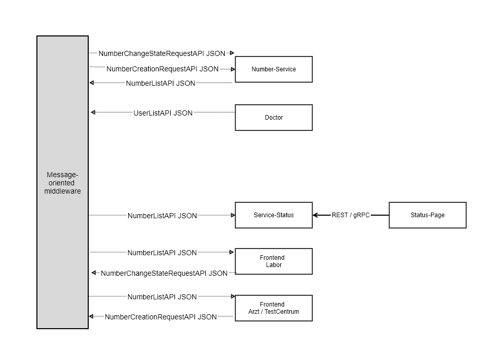
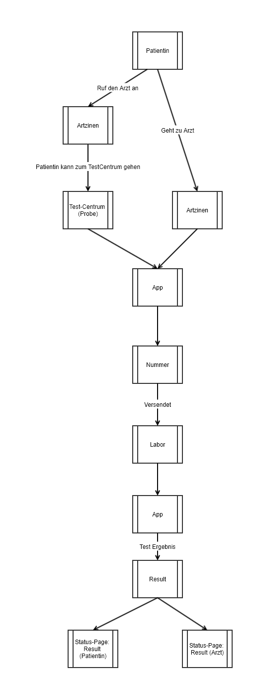
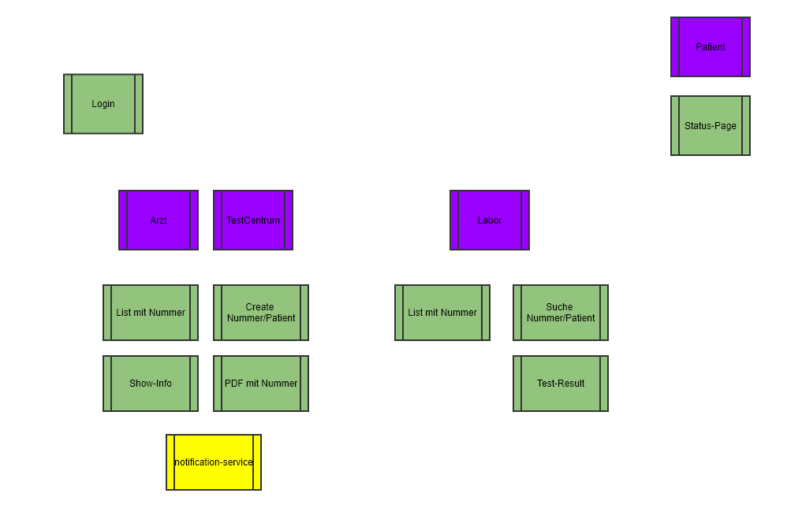

# documentation for microservice

### Technical dataflow




### Json Example:

##### NumberCreationRequestAPI JSON
```
{
	doctorId: 1,
	number: NRW202003202237371DTAHDT,
	creationDate: '2020-03-20 20:21:22'
}
```

##### UserListAPI JSON

```
[
	{
		doctorId: 1,
		number: NRW202003202237371DTAHDT,
		creationDate: '2020-03-20 20:21:22',
		modifiedStateDate: null,
		status: null
	},
	{
		doctorId: 2,
		number: NRW201902202237371ZUCYTD,
		creationDate: '2020-03-20 20:21:22',
		modifiedStateDate: '2020-03-20 20:21:22',
		status: true 
	},
    ...
    ...
    ...
]
```

##### NumberChangeStateRequestAPI JSON
```
{
	number: NRW202003202237371DTAHDT,
	modifiedStateDate: '2020-03-20 20:21:22',
	status: false
}
```

##### UserListAPI JSON
```
[
	{
		userId: 1,
		email: 'user-1@de.de',
		role: 'Doctor',
	},
	{
		userId: 2,
		email: 'user-2@de.de',
		role: 'Labor',
	},
    ...
    ...
    ...
]
```

### Business dataflow






#### Program for edit

[Chrome-Extenstion Gliffy](https://chrome.google.com/webstore/detail/gliffy-diagrams/bhmicilclplefnflapjmnngmkkkkpfad?utm_source=chrome-app-launcher-info-dialog)

File: [./data-flow.gliffy](https://raw.githubusercontent.com/football-betting/documentation/master/data-flow.gliffy)


